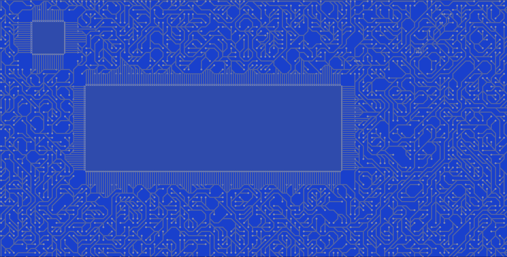
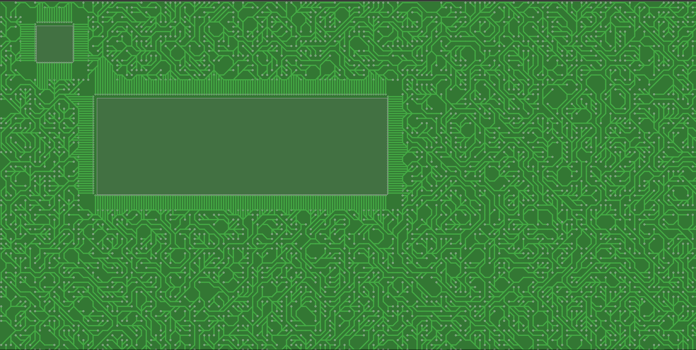
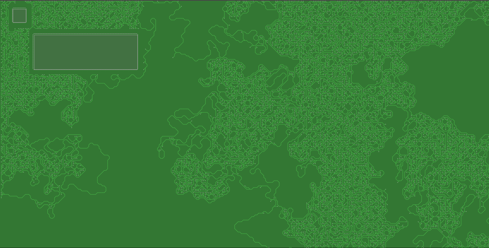
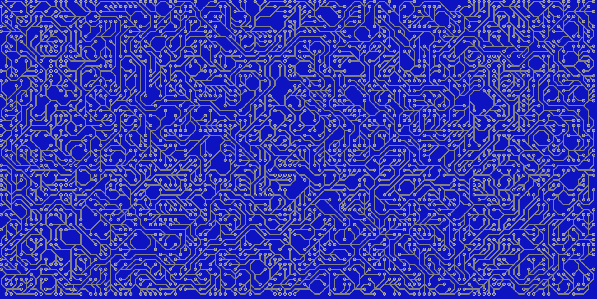
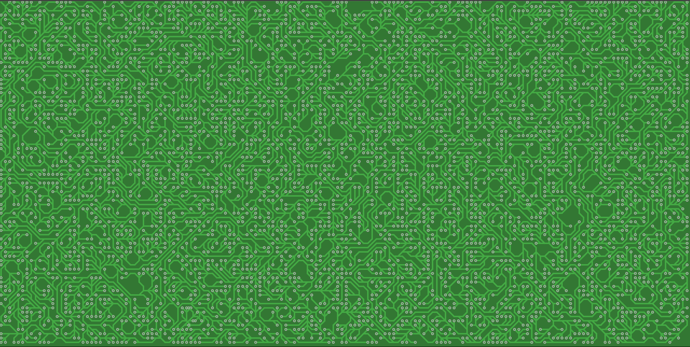

# PCB Circuit Generator

- **Main Version (main branch)**: This version includes support for chips and more complex circuit designs.
- **Simpler Version (no-chips branch)**: A streamlined version that excludes chips for simpler circuits.

## </> Features
### Main Version (main branch)

|:-----------------------------:|
| Main Version Rendered Example |


|:--------------------------------------------:|
| Main Version Rendered Example x2 (Green PCB) |

- Supports IC (integrated circuit) chips in the PCB design.
- Customizable component parameters.


|:--------------------------------------------:|
| Fractal Growth on ZommOut Example |

### No-Chips Version (no-chip-version branch)

|:--------------------------------:|
| No-Chip Version Rendered Example |


|:-----------------------------------------------:|
| No-Chip Version Rendered Example x2 (Green PCB) |

- Designed for simpler PCB layouts.
- Excludes support for IC chips.
- Provides optimized routing for minimal component designs.

## </> Obstacle (Chip) Detection
The PCB layout is dynamically generated using HTML and CSS elements inside the `pcb-container` div. Obstacles are defined as `div` elements with the class `pcb-obstacle`. Each obstacle has inline styles that determine:
- **Width and Height**: Defines the size of the obstacle.
- **Top and Left**: Specifies its position on the PCB.

Example:
```html
<div id="pcb-container">
    <svg id="pcb"></svg>
    <div class="pcb-obstacle" style="width: 150px; height: 150px; top: 100px; left: 150px;"></div>
    <div class="pcb-obstacle" style="width: 1200px; height: 400px; top: 400px; left: 400px;"></div> 
</div>
```
These obstacles are fetched and processed to adjust routing paths dynamically.

## </> Issues
### Recursiveness in Routing
One of the key challenges in this project is optimizing the recursive routing logic to avoid infinite loops and unnecessary recalculations. The current algorithm handles obstacle avoidance, but improvements can be made to:
- Reduce redundant path calculations.
- Optimize recursive depth for large PCB layouts.
- Enhance performance when handling multiple obstacles.

## </> Contributing
Pull requests are welcome. If you have ideas for improving the routing logic or obstacle detection, feel free to contribute.

## </> Contact
For inquiries or contributions, don't hesitate to contact me: [Haitam Bidiouane](https://github.com/sch0penheimer).

